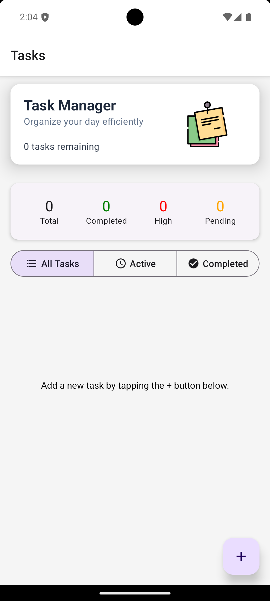
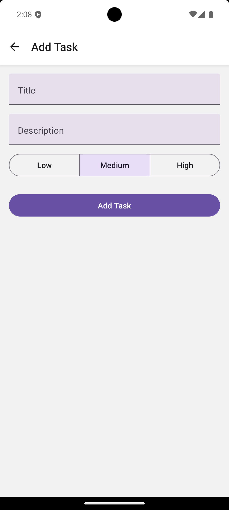
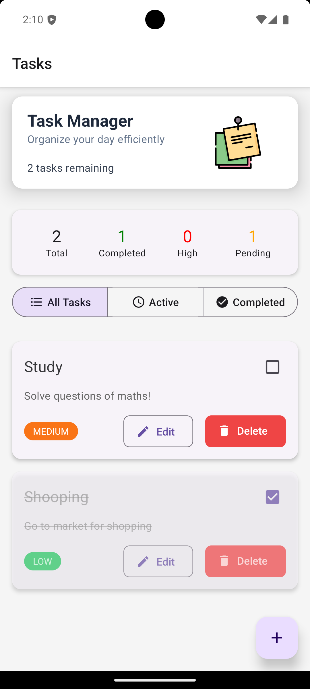

# Task Management App

A feature-rich React Native (Expo) application for managing daily tasks with an intuitive and modern user interface. Built using React Native Paper for UI components and Redux for state management.

## 📸 Screenshot




<!-- 

 -->

## Features

### Core Functionality
- Create, edit, and delete tasks
- Mark tasks as completed
- Set priority levels (Low, Medium, High)
- Filter tasks (All, Active, Completed)
- Task statistics dashboard
- Clean and modern UI

### User Interface
- Welcome banner with task counter
- Statistics dashboard showing:
  - Total tasks
  - Completed tasks
  - High priority tasks
  - Pending tasks
- Color-coded priority indicators
- Visual feedback for task status
- Intuitive task filtering
- Responsive design
- Material Design components

## Technology Stack

- React Native (Expo)
- Redux Toolkit for state management
- React Navigation for routing
- React Native Paper for UI components

## Installation

1. **Clone the repository**
```bash
git clone <repository-url>
cd task-management-app
```

2. **Install dependencies**
```bash
npm install
```

3. **Install required packages**
```bash
npm install @reduxjs/toolkit react-redux
npm install @react-navigation/native @react-navigation/stack
npm install react-native-paper
npm install react-native-screens react-native-safe-area-context
```

4. **Start the development server**
```bash
npx expo start
```

## Project Structure

```
task-management-app/
├── App.js
├── components/
│   ├── Banner.js
│   ├── TaskStats.js
│   └── TaskCard.js
├── navigation/
│   └── index.js
├── redux/
│   ├── store.js
│   └── taskSlice.js
└── screens/
    ├── TaskListScreen.js
    └── AddEditTaskScreen.js
```

## Usage Guide

### Adding a New Task
1. Tap the floating action button (+ icon) in the bottom right corner
2. Fill in the task details:
   - Title (required)
   - Description
   - Priority level
3. Press "Add Task" to save

### Managing Tasks
- **Edit Task**: Tap the "Edit" button on any task card
- **Delete Task**: Tap the "Delete" button on any task card
- **Complete Task**: Toggle the checkbox on the task card
- **Filter Tasks**: Use the segmented buttons at the top to filter between All, Active, and Completed tasks

### Task Priority Levels
- **High**: Red indicator
- **Medium**: Orange indicator
- **Low**: Green indicator

## Key Components

### Banner
- Displays app title and welcome message
- Shows total task count
- Material Design elevation for visual hierarchy

### Statistics Dashboard
- Quick overview of task status
- Color-coded statistics
- Responsive grid layout

### Task Cards
- Clear visual hierarchy
- Priority indicators
- Action buttons for edit and delete
- Checkbox for completion status
- Visual feedback for completed tasks

## Redux State Management

### Actions
- `addTask`: Create a new task
- `editTask`: Modify existing task
- `deleteTask`: Remove task
- `toggleComplete`: Toggle task completion status

### State Structure
```javascript
{
  tasks: {
    tasks: [
      {
        id: string,
        title: string,
        description: string,
        priority: 'LOW' | 'MEDIUM' | 'HIGH',
        completed: boolean
      }
    ]
  }
}
```

## Performance Considerations

- Efficient task filtering
- Optimized re-rendering with Redux
- Responsive UI components
- Proper component memoization

## Future Enhancements

- [ ] Add local storage persistence
- [ ] Implement due dates and reminders
- [ ] Add task categories/tags
- [ ] Include search functionality
- [ ] Add sorting options
- [ ] Implement data backup/restore
- [ ] Add dark mode support
- [ ] Include task sharing capabilities
- [ ] Add task notes/attachments
- [ ] Implement task recurring options

## Contributing

1. Fork the repository
2. Create your feature branch (`git checkout -b feature/AmazingFeature`)
3. Commit your changes (`git commit -m 'Add some AmazingFeature'`)
4. Push to the branch (`git push origin feature/AmazingFeature`)
5. Open a Pull Request

## License

This project is licensed under the MIT License - see the [LICENSE.md](LICENSE.md) file for details.

## Acknowledgments

- React Native team for the excellent mobile framework
- React Navigation team for the routing solution
- Callstack team for React Native Paper
- Redux team for the state management solution
